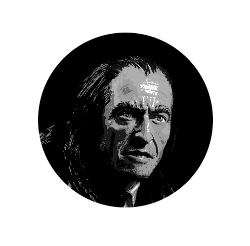
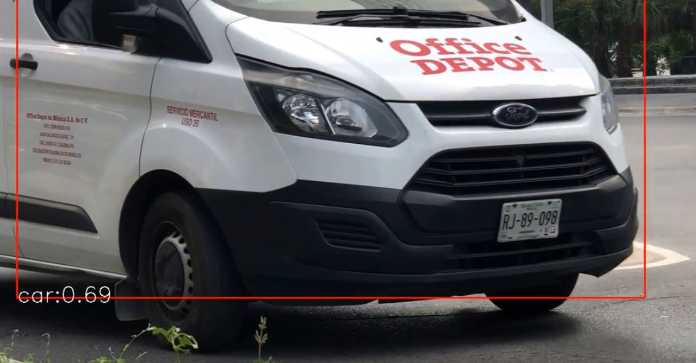
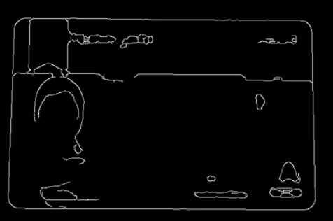

# Accenture Parking Solution
## Argus

## Summary

Software for license plates, id-text, car detection and faces recognition. Useful on
residential subdivision entrances where security guards are required to register every visitor that comes in.

### Id Detection

Detección de coches usando tinyYolov3

Detección de contornos de identificaciones

## Index
 * [Prerequisites](#Prerequisites)
 * [Installation](#Installation)
 * [Using_the_software](#Using_the_software )
 
## Prerequisites

Before you continue, ensure you meet the following requirements:

- Python > 3.0, pip
- Node
- AWS credentials

## Installation

The libraries used can be installed with the following commands:

- OpenCV

`pip install opencv-python`

- Pytesseract >= 4.0

`pip install pytesseract`

- Imutils

`pip install imutils`

- Pillow

`pip install Pillow`

- Boto3

`pip install boto3`

## Using the software

`python main.py "Path to licence plate image`

## Contributors

[Juan Manuel Perez](https://github.com/juanmapf97)

[Ivana Collado](https://github.com/IvanaColl)

[Oscar Laureano Haro](https://github.com/oscarlaureano)

[Diego Fernando Valencia](https://github.com/diegoValencia97)

